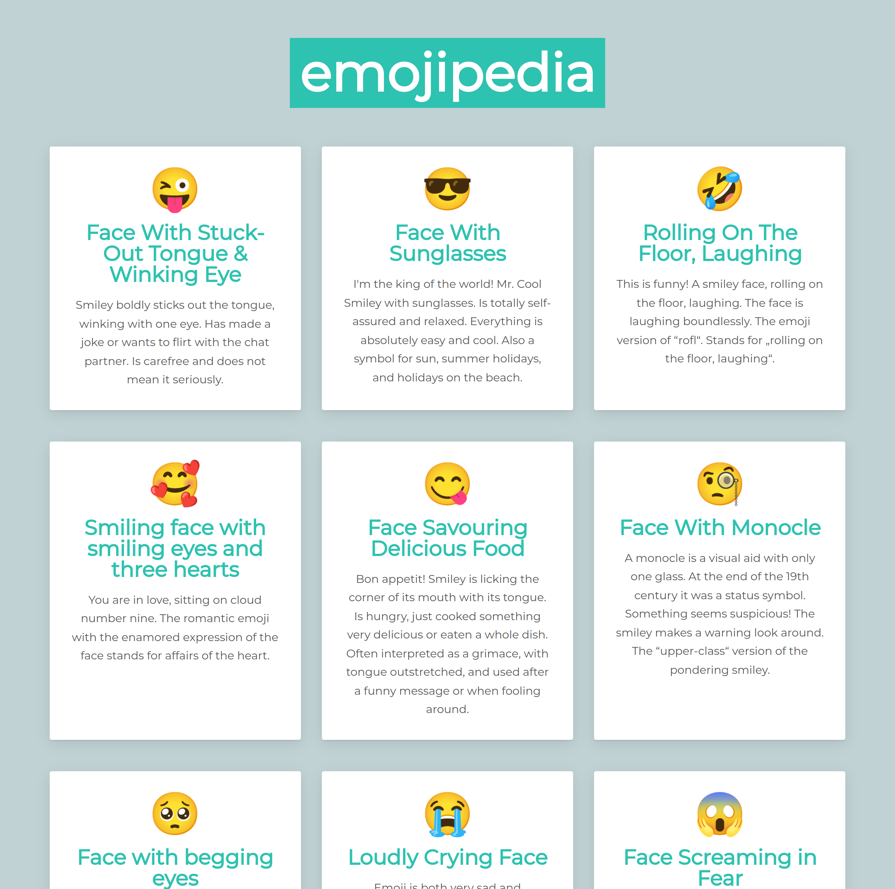

<h1 align="center"><a href="#" alt="site do keeper"> EMOJIPEDIA 📃 </a></h1>




<br><h4 align="center"> 🟢 Status do projeto:  Concluído ✔️   </h4> <br>

## 💻 Descrição do projeto 

 O Emojipedia é um projeto usando o React. Acessando o site você consegue descobrir os significados de alguns emojis mais populares da internet
 
 <br>


## 🚀 Como executar o projeto


### ⚠️ Pré-requisitos:

Antes de começar, você vai precisar ter instalado em sua máquina as seguintes ferramentas:
[Git](https://git-scm.com), [Node.js](https://nodejs.org/en/). 
Além disto é bom ter um editor para trabalhar com o código como [VSCode](https://code.visualstudio.com/)


### 🔧 Como instalar e rodar a aplicação:

```bash
# Clone este repositório
$ git clone https://github.com/anafts/Emojipedia-react.git

# Acesse a pasta do projeto no terminal/cmd
$ cd Emojipedia-react

# Instale as dependências
$ npm install

# Execute a aplicação em modo de desenvolvimento
$ npm start

# O servidor inciará na porta:3000 - acesse http://localhost:3000 
```

<br>

## 🛠️ Linguagens, dependencias e libs utilizadas


<br>

## 👨‍💻 Contribuidores

<table>
  <tr>
    <td align="center"><a href="https://www.linkedin.com/in/ana-freitas-794b3523b/"><br /><sub><b>Ana Freitas</b></sub></a><br /><a href="https://github.com/anafts">🦉</a></td>
  </tr>
</table>


 
